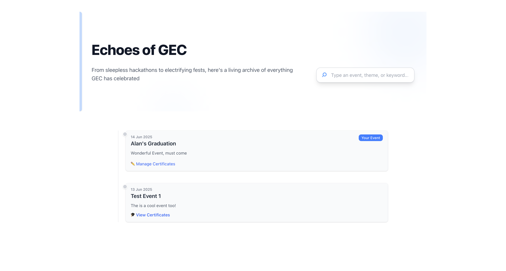
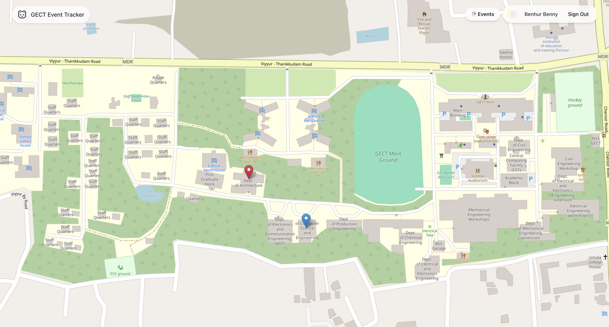

# 🗺️ GEC Event Tracker

A minimal, open-source event tracking platform built with Next.js + Prisma + Tailwind.  
Perfect for colleges to manage campus-wide event visibility.

---

## 🚀 Features

- Interactive event map with markers 🧭
- Event descriptions, schedules & timelines
- Certificate link support for participants 🎓
- Role-based controls for event creators
- Fully responsive & mobile-friendly

---

## 🛠 Tech Stack

- [Next.js](https://nextjs.org) App Router
- [Prisma](https://prisma.io) with NeonDB
- [Tailwind CSS](https://tailwindcss.com)
- [shadcn/ui](https://ui.shadcn.dev) for components
- [NextAuth](https://next-auth.js.org/) for auth
- [React Leaflet](https://react-leaflet.js.org/) for map

---

## ⚙️ Getting Started

```bash
git clone https://github.com/your-username/gec-event-tracker
cd gec-event-tracker
npm install
```

- Configure your environment variables in `.env`
- Run the dev server:

```bash
npm run dev
```

Open `http://localhost:3000` in your browser.

---

## 🧪 Local Setup Notes

- Make sure you set up NeonDB or PostgreSQL and run:

```bash
npx prisma migrate dev
```

- Auth requires Google client ID/secret.
- You can customize the map logic in `components/MapClient.tsx`.

---

## 🧩 Make it Yours

Fork it, rebrand it, change the logo, coordinates and deploy it for your college!  
Contributions & PRs welcome.

---

## 🖼️ Screenshots

<p float="left">
  
  
</p>

---

## 🧰 Configuration

Before running the project, ensure you set up the following environment variables in your `.env` file:

```env
NEXTAUTH_URL=http://localhost:3000
NEXTAUTH_SECRET=your_random_secret
DATABASE_URL=your_neon_or_postgres_url
AUTH_GOOGLE_ID=your_google_oauth_client_id
AUTH_GOOGLE_SECRET=your_google_oauth_client_secret
```

Make sure you’ve created your Google OAuth credentials at [console.cloud.google.com](https://console.cloud.google.com).

---

## 🤝 Contributing

We welcome contributions from other colleges, FOSS communities, or students who want to build their own event tracker variant!

- Fork this repo
- Create a new branch: `git checkout -b my-feature`
- Commit your changes: `git commit -am 'Add new feature'`
- Push the branch: `git push origin my-feature`
- Open a Pull Request 🚀

---

## 📦 Deploy to Vercel

Easily deploy by clicking:

[](https://vercel.com/new)

---

## 📄 License

MIT — feel free to use, fork, and remix with credit.

---

> Built with ❤️ by ruhneb2004
